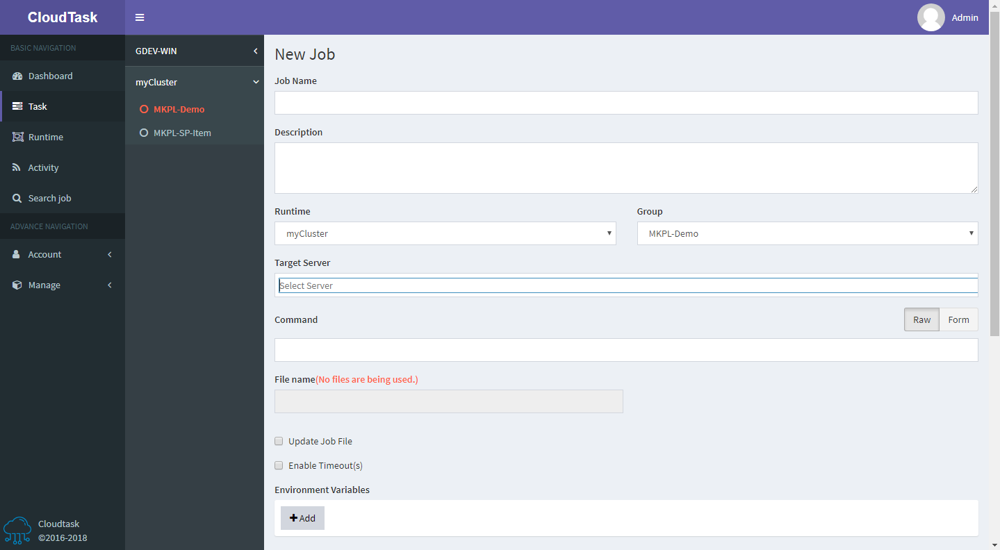

> 新建任务

按照页面表单所示填写表单信息

- `Runtime`: Job运行环境
- `Group`: Job所属的Group信息，用于将Job分类，Group信息可以在Group模块下创建
- `Target Server`: 运行Job的服务器，支持下拉选择和手动输入，若为空，则表示将在整个`Runtime`下随机分配`Server`运行Job
- `Command`: Job的运行命令（如 node index.js）
- `File name`: 展示Job的当前执行程序名，点击后面的删除按钮，可删除当前的Job执行程序
- `Update file`: 可选配置。选择Job的执行程序（必须是可执行程序并且按照 .tar.gz 格式进行压缩），或者在`Backup List`中选择Job的历史执行程序，选中后点击后面的Download按钮可以下载该执行程序。
- `Enable Timeout(s)`: 可选配置。设置Job的过期时间，单位为秒(s)，过期时间必须在`1s`到`172800s`(2天)的范围内
- `Environment Variables`：环境变量
- `Send Notification`: 可选配置。用于Job执行`成功`或者`失败`时的邮件通知
- `Schedules`：任务执行的时间表，若设置多个Schedule，则服务器会根据每个Schedule分别计算任务的下次执行时间，然后选择离现在时间最近的一个时间作为任务的下次执行时间